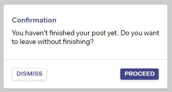

<div style="text-align: center">
  
</div>

# React Confirm [](https://npmjs.com/packages/@srph/react-confirm) [](https://travis-ci.org/srph/react-confirm?branch=master)
Replace native `confirm` function with yer modals.

View [demo](https://barber-solders-33074.netlify.com/). View [examples](storybook/confirm.js).

## Why?
This library was built to be flexible:

- It doesn't assume markup, styling, or template.
- It only provides the bare minimum so you could build your custom `confirm`.

## How It Works
This library uses the render props pattern. You can read more about it [here](https://cdb.reacttraining.com/use-a-render-prop-50de598f11ce).

## Installation
```bash
npm install @srph/react-confirm --save
```

### Script tags
If you're not using a bundler like Browserify or Webpack, simply add the script tag after your React script tag.

```html
<!-- Script tags for React and other libraries -->
<script src="https://unpkg.com/@srph/react-confirm/dist/react-confirm.min.js"></script>
```

This library is exposed as `ReactConfirm` (e.g., `ReactConfirm.confirm` and `ReactConfirm.ConfirmRoot`).

## Usage
`ConfirmRoot` must be placed on your top-most component (aka root component).

```js
import React from 'react'
import {confirm, ConfirmRoot} from '@srph/react-confirm'
import Modal from './Modal'

class App extends React.Component {
  render() {
    return (
      <div>
        <ConfirmRoot>
          {({active, text, actions}) => (
            <Modal isOpen={active} onRequestClose={actions.dismiss}>
              {text}
              <button onClick={actions.proceed}>Proceed</button>
              <button onClick={actions.dismiss}>Dismiss</button>
            </Modal>
          )}
        </ConfirmRoot>

        <button onClick={this.handleClick}>
          Open Confirmation
        </button>
      </div>
    )
  }

  handleClick() {
    confirm(`You haven't finished your post yet. Do you want to leave without finishing?`)
      .then(() => {
        console.log('Proceed')
      }, () => {
        console.log('Dismissed')
      })
  }
}

export default App;
```

### Hooks
In case you need to check if we're confirming, like for instance, we don't want our modal to be closed when `escape` is pressed.

```js
import React from 'react'
import {confirm} from '@srph/react-confirm'
import MyModal from './MyModal'

class App extends React.Component {
  state = {
    confirming: false
  }

  render() {
    return (
      <div>
        <MyModal enableEscapeClose={this.state.confirming}>
          // ...
          <button onClick={this.handleClick}>
            Submit Form
          </button>
        </MyModal>
      </div>
    )
  }

  handleClick() {
    this.setState({ confirming: true })

    confirm(`You haven't finished your post yet. Do you want to leave without finishing?`)
      .then(() => {
        this.setState({ confirming: false })
      }, () => {
        this.setState({ confirming: false })
      })
  }
}
```

### Custom options
If you want to pass any kind of other options, anything you pass to `confirm(opts)` except `text` is available through the render props' `options`. In the example below, we're allowing custom titles and extra actions / buttons.

```js
import React from 'react'
import {confirm} from '@srph/react-confirm'
import MyModal from './MyModal'

class CustomTitle extends React.Component {
  render() {
    return (
      <div>
        <ConfirmRoot>
          {({active, text, actions, options}) => (
            <Modal isOpen={active} onRequestClose={actions.dismiss}>
              {options.title || 'Confirmation'}

              <button className="button" onClick={actions.dismiss}>Dismiss</button>

              {options.buttons && options.buttons.map((button, i) =>
                <button className="button" onClick={button.onClick}>{button.text}</button>
              )}

              <button className="button -primary" onClick={actions.proceed}>Proceed</button>
            </Modal>
          )}
        </ConfirmRoot>

        <button className="button" onClick={this.handleClick}>
          Open Confirmation
        </button>
      </div>
    )
  }

  handleClick() {
    confirm({
      title: 'Leave page?',
      text:`You haven't finished your post yet. Do you want to leave without finishing?`
    }).then(() => {
      console.log('Proceed')
    }, () => {
      console.log('Dismissed')
    })
  }
}
```

This is kept flexible as everything is up to you.

View [examples](storybook/confirm.js).

## API Documentation
Here's a list of props you may use to customize the component for your use-case:

### `confirm(<mixed> opts)`

| Parameter  | Type | Description |
| ----- | ---- | ----------- |
| opts | `string` | Trigger the confirmation with the provided string. Shortcut for `confirm({ text: str })` |
| opts | `object` | Trigger the confirmation with custom settings. All properties except `opts.text` is mapped to `options` in `children` |
| opts.text | `string` | Text to be displayed |

> **NOTE**: More on this later

### ConfirmRoot

| Prop  | Type | Description |
| ----- | ---- | ----------- |
| children | `function` | This is where you render whatever based on the state of `ConfirmRoot` |

#### `children({active, text, options, actions})`

| Prop  | Type | Description |
| ----- | ---- | ----------- |
| active | `boolean` | If a confirmation is active |
| text | `string` | Text to be displayed |
| options | `object` | All properties passed to `confirm` except `text` is accessible here |
| actions | `object` | |
| actions.proceed | `object` | Proceed event handler |
| actions.dismiss | `object` | Dismiss event handler |

## Setup
You can check the [demo](https://barber-solders-33074.netlify.com/), or build it yourself locally:

```bash
npm install
npm run start
```

Afterwards, open up `localhost:9001` in your browser.

### Bundling package
```
npm run bundle
```

### Publish storybook
```
npm run storybook:publish
```
